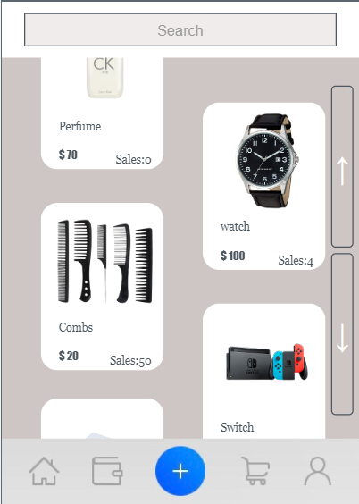

# Online-Shop-App

## Overview

This Shopping App is a comprehensive platform designed to facilitate online shopping with various features including user authentication, item browsing, shopping cart management, and chatting. This app was developed as a project for my 11th-grade coursework, demonstrating skills in JavaScript, database management, and user interface design.

## Features

1. **User Authentication**: Users can sign up and log in using their credentials. Passwords are securely managed with hidden input fields.
2. **Home Page**: Displays a selection of items with pictures, names, prices, and sales information. Users can browse items and view detailed information.
3. **Shopping Cart**: Users can add items to their shopping cart, update quantities, and proceed to checkout.
4. **Chat Functionality**: Users can send messages to item posters for inquiries.
5. **Item Posting**: Users can post items for sale with details such as name, price, picture, introduction, and type.
6. **Wallet Management**: Users can manage their wallet, add cards, and select a card for payment during checkout.

## How to Use

1. **Sign Up**: New users can sign up by providing a username and password.
2. **Log In**: Existing users can log in using their credentials.
3. **Browse Items**: On the home page, users can browse through available items.
4. **View Item Details**: Clicking on an item displays detailed information.
5. **Add to Cart**: Users can add items to their shopping cart.
6. **Checkout**: Users can view their cart and proceed to checkout using their wallet.
7. **Chat with Poster**: Users can contact item posters directly through the chat feature.
8. **Post New Items**: Users can post new items for sale by filling out a form with item details.
9. **Manage Wallet**: Users can add new cards to their wallet and choose a card for payments.

## Development

The application is developed using JavaScript on the [code.org](https://studio.code.org/projects/applab/5NZcBIgXKhO9SX4pax3w7Mobuc3tm2PEB2vW4N85vzY) platform. It utilizes database functions for storing user information, item details, and transactions.

## Note

This project is a demonstration of skills learned in 11th grade and may contain simplified code suitable for educational purposes.
